## Name : Atanu Ghosh
## Roll : 001910501005
## BCSE UG III (Sem II)
## AI Lab Assignment 1

---

#### Question 1

1. Implement the following uninformed search techniques 
    * Breadth first search 
    * Depth first search
    * Depth limited search 
    * Iterative deepening search
    * Iterative broadening search


#### Solution

```cpp
#include <algorithm>
#include <functional>
#include <iostream>
#include <map>
#include <queue>
#include <unordered_map>
#include <vector>
using namespace std;

vector<vector<int>> graph;
vector<int> order;
vector<bool> vis;
int vertices, edges;

// method to perform dfs
void dfs(int node, map<int, vector<int>> &paths, vector<int> &path) {
    if (!vis[node]) {
        vis[node] = true;
        order.push_back(node);
        path.push_back(node);
        if (paths.find(node) != paths.end()) {
            for (auto ele : path) paths[node].push_back(ele);
        }
        for (auto child : graph[node]) {
            dfs(child, paths, path);
        }
        path.pop_back();
    }
}

// method to perform bfs
void bfs(int start, map<int, vector<int>> &paths, vector<int> &path) {
    queue<int> q;
    unordered_map<int, int> par;
    par[start] = -1;
    q.push(start);
    vis[start] = true;

    while (!q.empty()) {
        int node = q.front();
        order.push_back(node);
        q.pop();
        for (auto child : graph[node]) {
            if (!vis[child]) {
                vis[child] = true;
                par[child] = node;
                q.push(child);
            }
        }
    }
    for (auto itr : paths) {
        int parent = itr.first;
        while (parent != -1) {
            paths[itr.first].push_back(parent);
            parent = par[parent];
        }
        reverse(paths[itr.first].begin(), paths[itr.first].end());
    }
}

// method to implement ibs
void ibs(int start, map<int, vector<int>> &paths, vector<int> &path) {
    int limit;
    cout << "Enter the ibs limit --> ";
    cin >> limit;

    queue<int> q;
    unordered_map<int, int> par;
    par[start] = -1;
    q.push(start);
    vis[start] = true;

    while (!q.empty()) {
        int node = q.front();
        order.push_back(node);
        q.pop();
        for (int it = 0; it <= min(limit - 1, (int)graph[node].size() - 1);
             ++it) {
            int child = graph[node][it];
            if (!vis[child]) {
                vis[child] = true;
                par[child] = node;
                q.push(child);
            }
        }
    }
    for (auto itr : paths) {
        if (vis[itr.first]) {
            int parent = itr.first;
            while (parent != -1) {
                paths[itr.first].push_back(parent);
                parent = par[parent];
            }
            reverse(paths[itr.first].begin(), paths[itr.first].end());
        }
    }
}

// method to perform depth limited search
void dls(int node, map<int, vector<int>> &paths, vector<int> &path, int curr_depth, int depth_limit) {
    if (!vis[node] && curr_depth < depth_limit) {
        vis[node] = true;
        order.push_back(node);
        path.push_back(node);
        if (paths.find(node) != paths.end()) {
            for (auto ele : path) paths[node].push_back(ele);
        }
        for (auto child : graph[node]) {
            dls(child, paths, path, curr_depth + 1, depth_limit);
        }
        path.pop_back();
    }
}

// method to initialising the graph
void initGraph() {
    cout << "Enter the number of vertices --> ";
    cin >> vertices;
    cout << "Enter the number of edges --> ";
    cin >> edges;
    graph.assign(vertices + 1, vector<int>());
    while (edges--) {
        int u, v;
        cin >> u >> v;
        graph[u].push_back(v);
        graph[v].push_back(u);
    }
}

// to initialise the tools required to apply search techniques on the graph
void initialiseUtilityTools(int &start, map<int, vector<int>> &paths, vector<int> &path) {
    int goal, no_of_goal;
    cout << "Enter the start --> ";
    cin >> start;
    cout << "Enter the number of goal nodes --> ";
    cin >> no_of_goal;
    cout << "Enter the Goal Nodes --> ";
    while (no_of_goal--) {
        cin >> goal;
        paths[goal] = path;
    }
}

// method to print the paths of all goal nodes
void printPaths(map<int, vector<int>> paths) {
    for (auto itr : paths) {
        if (vis[itr.first]) {
            cout << "Goal Encountered --> " << itr.first << "\n";
            for (auto ele : paths[itr.first]) {
                cout << ele << " ";
            }
            cout << "\n";
        } else {
            cout << itr.first << " -> Goal could not be reached\n";
        }
    }
}

// method to perform ids;
void ids() {
    map<int, vector<int>> paths;
    vector<int> path;
    int start, max_depth;

    initialiseUtilityTools(start, paths, path);
    cout << "Enter max depth --> ";
    cin >> max_depth;

    auto checkIfAllGoalsReached = [&](vector<bool> &temp) -> bool {
        for (auto itr : paths) {
            if (!temp[itr.first]) return false;
        }
        return true;
    };
    // performing the search operation
    vector<bool> temp(vertices + 1, false);
    for (int depth = 0; depth <= max_depth; depth++) {
        if (!checkIfAllGoalsReached(temp)) {
            vis.assign(vertices + 1, false);
            dls(start, paths, path, 0, depth);
            temp = vis;
        }
    }
    printPaths(paths);
}

// utility function to perform the search operation depending on the technique passed as argument
void utilityDFS_BFS_IBS(function<void(int, map<int, vector<int>> &, vector<int> &)> searchFunction) {
    map<int, vector<int>> paths;
    vector<int> path;
    int start;
    initialiseUtilityTools(start, paths, path);
    vis.assign(vertices + 1, false);
    searchFunction(start, paths, path);
    printPaths(paths);
}

void printOrder() {
    cout << "Order --> ";
    for (auto node : order) cout << node << " ";
    cout << endl;
}

// driver function to do the same
int main() {
    int n, m;
    while (true) {
        int ch = -1;
        cout << "1. Enter Graph\n2. DFS\n3. BFS\n4. DLS\n5. IDS\n6. IBS\n"
				"7. Clear Graph and Exit\nEnter Choice --> ";
        cin >> ch;
        switch (ch) {
            case 1:
                initGraph();
                break;
            case 2: {
                order.clear();
                utilityDFS_BFS_IBS(&dfs);
                printOrder();
                break;
            }
            case 3: {
                order.clear();
                utilityDFS_BFS_IBS(&bfs);
                printOrder();
                break;
            }
            case 4: {
                int start;
                map<int, vector<int>> paths;
                vector<int> path;

                initialiseUtilityTools(start, paths, path);

                int depth_limit;
                cout << "Enter the depth limit --> ";
                cin >> depth_limit;
                vis.assign(vertices + 1, false);
                order.clear();
                dls(start, paths, path, 0, depth_limit);
                printPaths(paths);
                printOrder();
                break;
            }
            case 5: {
                ids();
                break;
            }
            case 6: {
                order.clear();
                utilityDFS_BFS_IBS(&ibs);
                printOrder();
                break;
            }
            case 7: {
                graph.clear();
                order.clear();
                vis.clear();
                cout << "Exiting System...Exited!!\n";
                exit(0);
            }
            default:
                exit(0);
                break;
        }
    }
    return 0;
}
```


#### Input

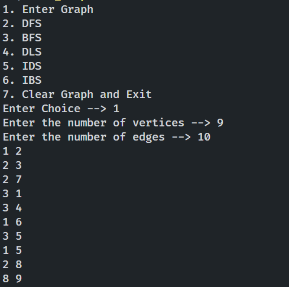


#### Output

* BFS

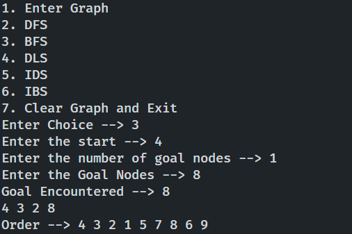


* DFS

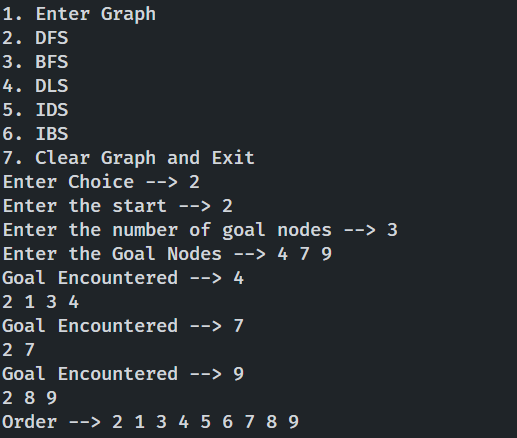


* DLS

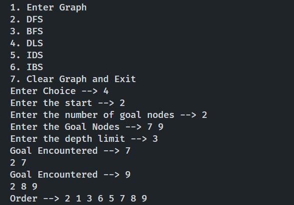


* IDS


* IBS

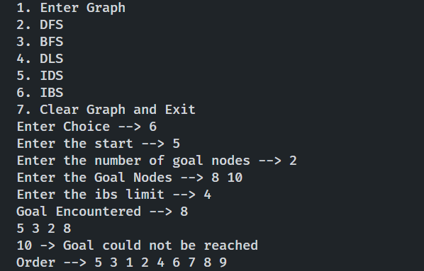


#### Implementation of above algorithms in a puzzle problem

```cpp
#include <algorithm>
#include <iostream>
#include <map>
#include <queue>
#include <utility>
#include <vector>
using namespace std;

vector<vector<int>> chessboard;
int n, st_x, st_y, tg_x, tg_y;

vector<pair<int, int>> order;
bool canGo(int x, int y) {
    if (x >= 0 && y >= 0 && x < n && y < n) return chessboard[x][y];
    return false;
}

vector<pair<int, int>> dir = {{1, 2}, {-1, 2},  {1, -2}, {-1, -2},
                              {2, 1}, {-2, -1}, {-2, 1}, {2, -1}};

void getPathUsingDFS(int start_x, int start_y, int target_x, int target_y, vector<pair<int,int>> &path, vector<pair<int, int>> &temp_path, vector<vector<bool>> &vis) {
    if (!vis[start_x][start_y]) {
        vis[start_x][start_y] = true;
        order.push_back({start_x, start_y});
        temp_path.push_back({start_x, start_y});
        if (start_x == target_x && start_y == target_y) {
            // target reached
            path = temp_path;
            return;
        }

        for (pair<int, int> move : dir) {
            int next_x = start_x + move.first;
            int next_y = start_y + move.second;
            if (canGo(next_x, next_y)) {
                if (!vis[next_x][next_y])
                    getPathUsingDFS(next_x, next_y, target_x, target_y, path, temp_path, vis);
            }
        }
        temp_path.pop_back();
    }
}

void getPathUsingDLS(int start_x, int start_y, int target_x, int target_y, vector<pair<int, int>> &path, vector<pair<int, int>> &temp_path, vector<vector<bool>> &vis, int limit, int max_limit) {
    if (!vis[start_x][start_y] && limit < max_limit) {
        temp_path.push_back({start_x, start_y});
        order.push_back({start_x, start_y});
        vis[start_x][start_y] = true;
        if (start_x == target_x && start_y == target_y) {
            path = temp_path;
            return;
        }
        for (pair<int, int> move : dir) {
            int next_x = start_x + move.first;
            int next_y = start_y + move.second;
            if (canGo(next_x, next_y)) {
                if (!vis[next_x][next_y]) {
                    getPathUsingDLS(next_x, next_y, target_x, target_y, path, temp_path, vis, limit + 1, max_limit);
                }
            }
        }
        temp_path.pop_back();
    }
}

// performing IDLS to get the node within the specified level limits;
void getPathUsingIDLS(int start_x, int start_y, int target_x, int target_y, int max_limit) {
    bool flag = false;
    for (int limit = 1; limit <= max_limit; limit++) {
        vector<pair<int, int>> temp_path, path;
        vector<vector<bool>> vis(n + 1, vector<bool>(n + 1, false));
        getPathUsingDLS(start_x, start_y, target_x, target_y, path, temp_path,
                        vis, 0, limit);
        if (vis[target_x][target_y]) {
            cout << "---------path using IDLS----------------\n";
            for (pair<int, int> node : path) {
                cout << "{" << node.first << "," << node.second << "}" << "\n";
            }
            flag = true;
            break;
        }
    }
    if (!flag) {
        cout << "Target cannot be reached within the given limits\n";
    }
}

void getPathUsingBFS(int start_x, int start_y, int target_x, int target_y) {
    if (canGo(target_x, target_y) == false) {
        cout << "Entered target is out of the board\n";
        return;
    }
    vector<vector<bool>> vis(n, vector<bool>(n, false));
    queue<pair<int, int>> q;
    q.push({start_x, start_y});
    vis[start_x][start_y] = true;

    map<pair<int, int>, pair<int, int>> parent;
    parent[{start_x, start_y}] = {-1, -1};

    while (!q.empty()) {
        pair<int, int> curr_pos = q.front();
        q.pop();
        order.push_back(curr_pos);
        for (auto move : dir) {
            int next_pos_x = curr_pos.first + move.first;
            int next_pos_y = curr_pos.second + move.second;
            if (canGo(next_pos_x, next_pos_y)) {
                if (!vis[next_pos_x][next_pos_y]) {
                    parent[{next_pos_x, next_pos_y}] = {curr_pos.first, curr_pos.second};
                    vis[next_pos_x][next_pos_y] = true;
                    q.push({next_pos_x, next_pos_y});
                }
            }
        }
    }

    vector<pair<int, int>> path;
    pair<int, int> par = {target_x, target_y};

    if (!vis[target_x][target_y]) {
        cout << "Goal Cannot be reached !\n";
    } else {
        while (par.first != -1 && par.second != -1) {
            path.push_back(par);
            par = parent[par];
        }
        reverse(path.begin(), path.end());
        cout << "------------path using BFS-------------\n";
        for (pair<int, int> node : path) {
            cout << "{" << node.first << "," << node.second << "}" << "\n";
        }
    }
}

void getPathUsingIBS(int start_x, int start_y, int target_x, int target_y) {
    if (canGo(target_x, target_y) == false) {
        cout << "Entered target is out of the board\n";
        return;
    }
    int limit;
    cout << "Enter IBS limit --> ";
    cin >> limit;
    vector<vector<bool>> vis(n, vector<bool> (n, false));
    queue<pair<int, int>> q;
    q.push({start_x, start_y});
    vis[start_x][start_y] = true;

    map<pair<int, int>, pair<int, int>> parent;
    parent[{start_x, start_y}] = {-1, -1};

    while (!q.empty()) {
        pair<int, int> curr_pos = q.front();
        q.pop();
        order.push_back(curr_pos);
        for (int itr = 0; itr < min(limit, (int)dir.size()); ++itr) {
            pair<int, int> move = dir[itr];
            int next_pos_x = curr_pos.first + move.first;
            int next_pos_y = curr_pos.second + move.second;
            if (canGo(next_pos_x, next_pos_y)) {
                if (!vis[next_pos_x][next_pos_y]) {
                    parent[{next_pos_x, next_pos_y}] = {curr_pos.first, curr_pos.second};
                    vis[next_pos_x][next_pos_y] = true;
                    q.push({next_pos_x, next_pos_y});
                }
            }
        }
    }

    vector<pair<int, int>> path;
    pair<int, int> par = {target_x, target_y};

    if (!vis[target_x][target_y]) {
        cout << "Goal Cannot be reached !\n";
    } else {
        while (par.first != -1 && par.second != -1) {
            path.push_back(par);
            par = parent[par];
        }
        reverse(path.begin(), path.end());
        cout << "------------path using IBS-------------\n";
        for (pair<int, int> node : path) {
            cout << "{" << node.first << "," << node.second << "}" << "\n";
        }
    }
}

void getSourceTarget() {
    cout << "Enter the start cell index (space separated i, j) --> ";
    cin >> st_x >> st_y;
    cout << "Enter the target cell index (space separated i, j) --> ";
    cin >> tg_x >> tg_y;
}

// function to print the order of search techniques;
void printOrder() {
    cout << "---------Order-----------\n";
    for (pair<int, int> node : order) {
        cout << "{" << node.first << "," << node.second << "}" << "\n";
    }
}

// driver code to test the functionality
int main() {
    while (1) {
        int ch;
        cout << "1. Enter Chess Board size\n2. BFS\n3. DFS\n4. DLS\n"
                "5. IDS\n6. IBS\nEnter Choice :- ";
        cin >> ch;
        switch (ch) {
            case 1: {
                cout << "Enter the chess board size :- ";
                cin >> n;
                cout << "Enter the chess board with obstacles :- (0 -> obstacle)\n";
                chessboard.assign(n, vector<int>(n, 0));
                for (int i = 0; i < n; ++i) {
                    for (int j = 0; j < n; ++j) {
                        cin >> chessboard[i][j];
                    }
                }
                break;
            }
            case 2: {
                getSourceTarget();
                order.clear();
                getPathUsingBFS(st_x, st_y, tg_x, tg_y);
                printOrder();
                break;
            }
            case 3: {
                vector<vector<bool>> vis(n, vector<bool>(n, false));
                vector<pair<int, int>> temp_path, path;
                getSourceTarget();
                order.clear();
                getPathUsingDFS(st_x, st_y, tg_x, tg_y, path, temp_path, vis);
                // print the path obtained using DFS
                cout << "---------Path using DFS-------\n";
                for (pair<int, int> node : path) {
                    cout << "{" << node.first << "," << node.second << "}\n";
                }
                printOrder();
                break;
            }
            case 4: {
                vector<vector<bool>> vis(n, vector<bool>(n, false));
                vector<pair<int, int>> temp_path, path;
                int max_limit;
                cout << "Enter max limit --> ";
                cin >> max_limit;
                order.clear();
                getSourceTarget();
                getPathUsingDLS(st_x, st_y, tg_x, tg_y, path, temp_path, vis, 0, max_limit);

                // print the path obtained using DFS
                if (vis[tg_x][tg_y]) {
                    cout << "---------Path using DLS-------\n";
                    for (pair<int, int> node : path) {
                        cout << "{" << node.first << "," << node.second << "}\n";
                    }
                } else {
                    cout << "Target could not be reached within the given depth limits\n";
                }
                printOrder();
                break;
            }
            case 5: {
                getSourceTarget();
                int max_limit;
                cout << "Enter the max limit --> ";
                cin >> max_limit;
                getPathUsingIDLS(st_x, st_y, tg_x, tg_y, max_limit);
                break;
            }
            case 6: {
                getSourceTarget();
                order.clear();
                getPathUsingIBS(st_x, st_y, tg_x, tg_y);
                printOrder();
                break;
            }
            default: {
                exit(0);
            }
        }
    }
    return 0;
}
```

#### Input

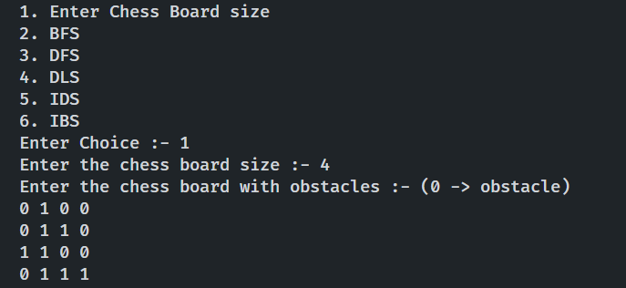


#### Output

* BFS

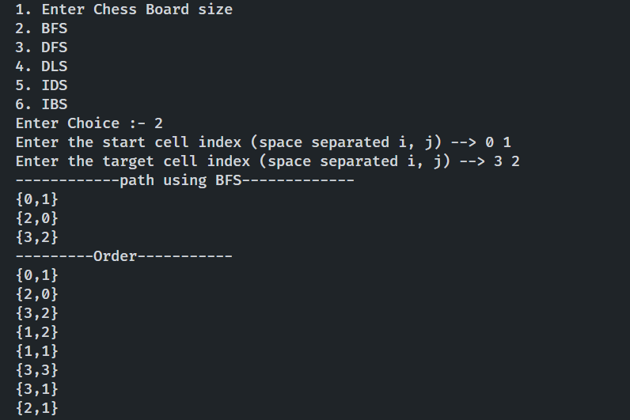


* DFS

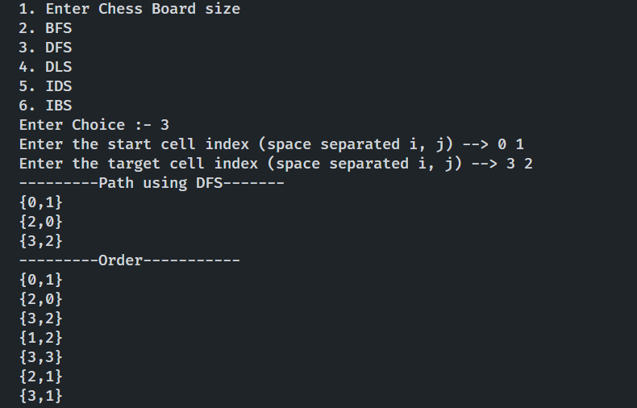


* DLS

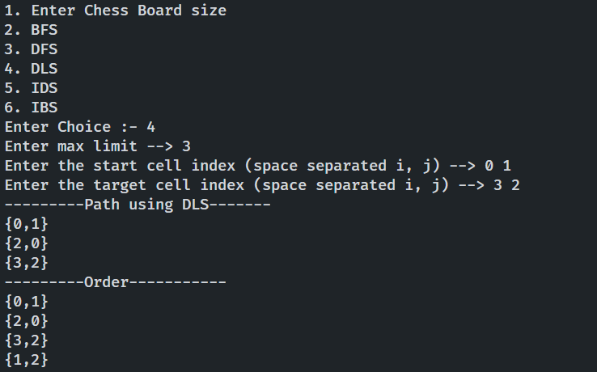


* IDS

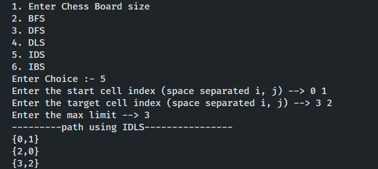


* IBS

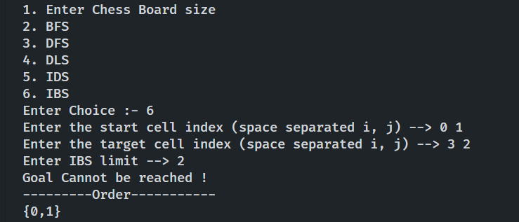

