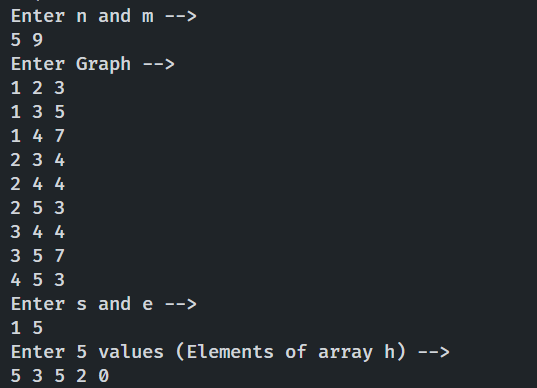
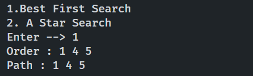
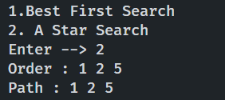

## Name : Atanu Ghosh
## Roll : 001910501005
## BCSE UG III (Sem II)
## AI Lab Assignment 2

---

#### Question 2

2. Implement the following :
	* Best first greedy search 
	* A* search algorithm


#### Solution

```cpp
#include <iostream>
#include <vector>
#include <queue>
#include <algorithm>
#include <utility>
#include <set>
#define INF 1e9+7

using namespace std;

struct answer
{
	vector <int> order;
	vector <int> path;
};

answer bfs(int s, int e, vector <pair<int,int>> adj[], int h[], int n) 
{
	int p[n+1];
	for(int i=1;i<=n;i++)
	p[i]=-1;

	answer ret;

	vector <bool> marked(n+1,false);
	set <pair<int,int>> st;	// dist, vertex
	st.insert({h[s],s});

	marked[s]=true;

	while(true)
	{
		auto v=*st.begin();
		ret.order.push_back(v.second);

		st.erase(v);

		if(v.second==e)
		break;

		for(auto u:adj[v.second])
		if(!marked[u.first])
		{
			st.insert({h[u.first],u.first});
			p[u.first]=v.second;
			marked[u.first]=true;
		}
	}

	int curr=e;
	while(curr!=-1)
	{
		ret.path.push_back(curr);
		curr=p[curr];
	}

	reverse(ret.path.begin(),ret.path.end());

	return ret;
}

answer astar(int s, int e, vector <pair<int,int>> adj[], int h[], int n)
{
	set <pair<int,int>> st;
	vector <int> d(n+1,INF);
	vector <int> p(n+1,-1);
	d[s]=h[s];

	answer ret;
	st.insert({h[s],s});

	while(true)
	{
		auto v=*st.begin();
		ret.order.push_back(v.second);

		st.erase(v);

		if(v.second==e)
		break;

		for(auto u:adj[v.second])
		if(d[u.first]>d[v.second]-h[v.second]+h[u.first]+u.second)
		{
			st.erase({d[u.first],u.first});
			d[u.first]=d[v.second]-h[v.second]+h[u.first]+u.second;
			st.insert({d[u.first],u.first});
			p[u.first]=v.second;
		}
	}

	int curr=e;
	while(curr!=-1)
	{
		ret.path.push_back(curr);
		curr=p[curr];
	}

	reverse(ret.path.begin(),ret.path.end());

	return ret;
}

signed main()
{
	freopen("input.in","r",stdin);
    
	int n,m;
	cin>>n>>m;

	vector <pair<int,int>> adj[n+1];
	int h[n+1];

	for(int i=1;i<=m;++i)
	{
		int a,b,c;
		cin>>a>>b>>c;
		adj[a].push_back({b,c});
		adj[b].push_back({a,c});
	}

	int s,e;
	cin>>s>>e;

	for(int i=1;i<=n;i++)
	cin>>h[i];

	answer out=astar(s,e,adj,h,n);

	cout<<"ORDER"<<endl;
	for(auto x:out.order)
	cout<<x<<" ";
	cout<<endl<<"PATH"<<endl;
	for(auto x:out.path)
	cout<<x<<" ";
	cout<<endl;

    return 0;
}
```

#### Input



#### Ouput

* Best First Search



* A*




<br>


### Uniform Cost Search (UCS)

```cpp
// C++ implementation of above approach
#include <bits/stdc++.h>
using namespace std;

// graph
vector<vector<int>> graph;

// map to store cost of edges
map<pair<int, int>, int> cost;

// returns the minimum cost in a vector( if there are multiple goal states)
vector<int> uniform_cost_search(vector<int> goal, int start) {

    // minimum cost upto goal state from starting state
    vector<int> answer;

    // create a priority queue
    priority_queue<pair<int, int> > queue;

    // set the answer vector to max value
    for (int i = 0; i < goal.size(); i++) answer.push_back(INT_MAX);

    // insert the starting index
    queue.push(make_pair(0, start));

    // map to store visited node
    map<int, int> visited;

    // count
    int count = 0;

    // while the queue is not empty
    while (queue.size() > 0) {
        // get the top element of the
        // priority queue
        pair<int, int> p = queue.top();

        // pop the element
        queue.pop();

        // get the original value
        p.first *= -1;

        // check if the element is part of
        // the goal list
        if (find(goal.begin(), goal.end(), p.second) != goal.end()) {
            // get the position
            int index = find(goal.begin(), goal.end(), p.second) - goal.begin();

            // if a new goal is reached
            if (answer[index] == INT_MAX) count++;

            // if the cost is less
            if (answer[index] > p.first) answer[index] = p.first;

            // pop the element
            queue.pop();

            // if all goals are reached
            if (count == goal.size()) return answer;
        }

        // check for the non visited nodes
        // which are adjacent to present node
        if (visited[p.second] == 0) {
            for (int i = 0; i < graph[p.second].size(); i++) {
                // value is multiplied by -1 so that
                // least priority is at the top
                queue.push(make_pair(
                    (p.first + cost[make_pair(p.second, graph[p.second][i])]) * -1,
                    graph[p.second][i]));
            }
        }

        // mark as visited
        visited[p.second] = 1;
    }

    return answer;
}

// main function
int main() {
    // create the graph
    graph.resize(7);

    // add edge
    graph[0].push_back(1);
    graph[0].push_back(3);
    graph[3].push_back(1);
    graph[3].push_back(6);
    graph[3].push_back(4);
    graph[1].push_back(6);
    graph[4].push_back(2);
    graph[4].push_back(5);
    graph[2].push_back(1);
    graph[5].push_back(2);
    graph[5].push_back(6);
    graph[6].push_back(4);

    // add the cost
    cost[make_pair(0, 1)] = 2;
    cost[make_pair(0, 3)] = 5;
    cost[make_pair(1, 6)] = 1;
    cost[make_pair(3, 1)] = 5;
    cost[make_pair(3, 6)] = 6;
    cost[make_pair(3, 4)] = 2;
    cost[make_pair(2, 1)] = 4;
    cost[make_pair(4, 2)] = 4;
    cost[make_pair(4, 5)] = 3;
    cost[make_pair(5, 2)] = 6;
    cost[make_pair(5, 6)] = 3;
    cost[make_pair(6, 4)] = 7;

    // goal state
    vector<int> goal;

    // set the goal
    // there can be multiple goal states
    goal.push_back(6);

    // get the answer
    vector<int> answer = uniform_cost_search(goal, 0);

    // print the answer
    cout << "Minimum cost from 0 to 6 is = " << answer[0] << endl;

    return 0;
}
```
